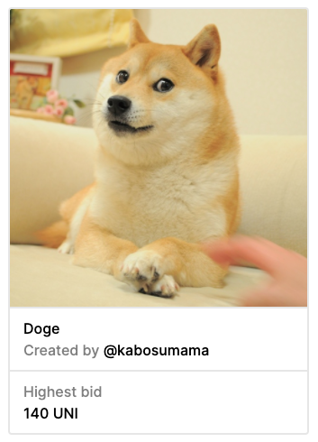
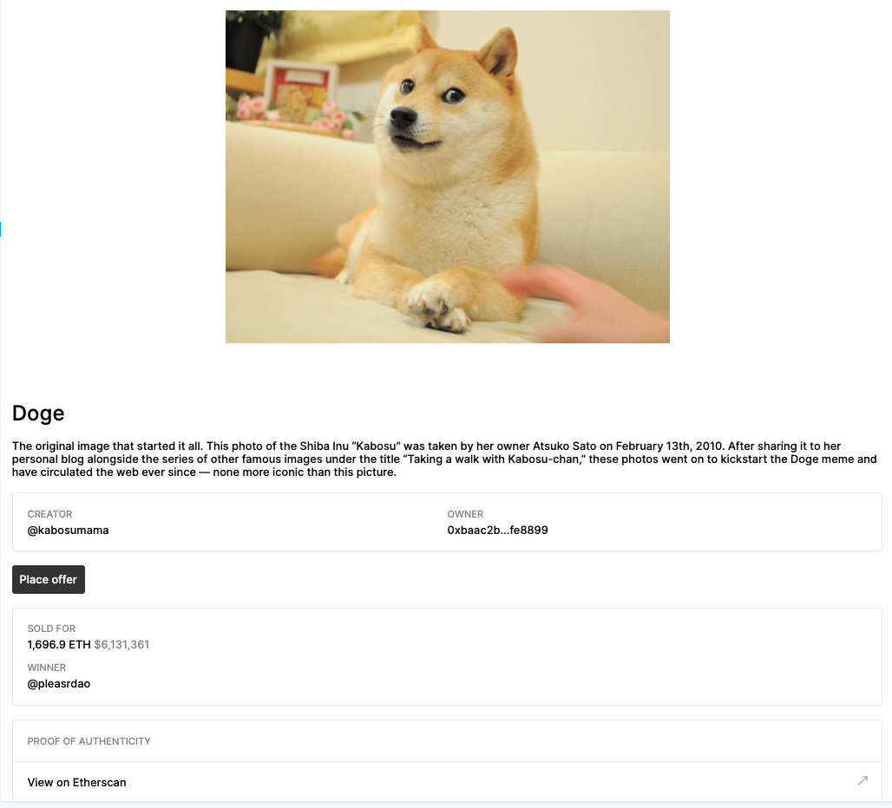

import Tabs from '@theme/Tabs'
import TabItem from '@theme/TabItem'

##### Tools for displaying NFTs

---

ZORA provides multiple tools for making it easy to display NFTs.

##### Displaying Options
- [NFT Iframe:](./introduction#nft-iframe) Embed NFTs into your own website
- [NFT Components:](./introduction#nft-components) React components that can be used to render NFT content
- [NFT Hooks:](./introduction#nft-hooks) Hooks for fetching NFT data

NFT Components assumes a `React` frontend and NFT Hooks is written in `TypeScript`.

---


## NFT Iframe 
Embed any NFT shown on [zora.co](https://zora.co/) into your own website. All iframes are mobile responsive and are compatible with text, images, videos, and audio.

You can generate an iframe by entering in the [zora.co URL](https://zora.co/collections/zora/5846) for the NFT that you would like to display at [embed.zora.co](https://embed.zora.co/).

<iframe src="https://embed.zora.co/0xabEFBc9fD2F806065b4f3C237d4b59D9A97Bcac7/5846?title=false&controls=false&loop=false&autoplay=false"
  width="325" 
  height="325" 
  scrolling="no" 
  allowtransparency="true" 
  allowfullscreen="true" 
  sandbox="allow-pointer-lock allow-same-origin allow-scripts allow-popups">
</iframe>
    
<br/>
<br/>

```html
<div style="max-width: 960px; margin: 0 auto; position: relative;">
  <style>.nft-embed-wrapper > iframe {width: 100%!important; height:100%!important; border: 0; position: absolute; top: 0; left: 0;}</style>
  <div class="nft-embed-wrapper" style="position: relative; width:100%; height:0; padding-bottom: 100%;">
    <iframe 
      src="https://embed.zora.co/0xabEFBc9fD2F806065b4f3C237d4b59D9A97Bcac7/5846?title=false&controls=false&loop=false&autoplay=false" width="100%" 
      height="100%" 
      scrolling="no" 
      allowtransparency="true" 
      allowfullscreen="true" 
      sandbox="allow-pointer-lock allow-same-origin allow-scripts allow-popups">
    </iframe>
  <div>
</div>
```

---

## NFT Components

This library is made up of `React` components that can be used to render ERC-721 NFTs.
Default styling and fetching URLs are included with the library along with caching mechanisms and the ability to easily customize strings, render components, and add different styling.

Links direct to ZORA.co interfaces, but can be overridden by building out the functionality with the [ZDK](../../../docs/developer-tools/zdk/introduction).

[**View Components Storybook Documentation ->**](https://ourzora.github.io/nft-components/?path=/story/introduction--page)

<Tabs
  defaultValue="yarn"
  values={[
    { label: 'Yarn', value: 'yarn', },
    { label: 'NPM', value: 'npm', }
  ]
}>
<TabItem value="yarn">

```bash
yarn add @zoralabs/nft-components
```

</TabItem>
<TabItem value="npm">

```bash
npm install @zoralabs/nft-components --save
```

</TabItem>
</Tabs>

##### NFT Preview Component



##### NFT Full Page Component




---

## NFT Hooks

This library consists of a data fetch class and associated hooks to load NFT data.
The API both batches and caches requests, meaning you can use the hooks across a page without needing to worry about
significant performance penalties.

| **Hook**                                                                       | **Usage**                                                      |
| ------------------------------------------------------------------------------ | -------------------------------------------------------------- |
| [useNFT](/docs/developer-tools/nft-rendering/nft-hooks/useNft)                 | Fetches all data for a ERC-721 NFT                             |
| [useNFTMetadata](/docs/developer-tools/nft-rendering/nft-hooks/useNFTMetadata) | Fetches NFT metadata from a URL                                |
| [useNFTContent](/docs/developer-tools/nft-rendering/nft-hooks/useNFTContent)   | Fetches content for rendering from content URL in the metadata |

<br />

<Tabs
  defaultValue="yarn"
  values={[
    { label: 'Yarn', value: 'yarn', },
    { label: 'NPM', value: 'npm', }
  ]
}>
<TabItem value="yarn">

```bash
yarn add @zoralabs/nft-hooks
```

</TabItem>
<TabItem value="npm">

```bash
npm install @zoralabs/nft-hooks --save
```

</TabItem>
</Tabs>

```typescript
import { useZNFT, useNFTMetadata } from '@zoralabs/nft-hooks'

function MyNFT() {
  const { data } = useNFT('0xabEFBc9fD2F806065b4f3C237d4b59D9A97Bcac7', '20')
  const { metadata } = useNFTMetadata(data && data.metadataURI)

  return (
    <div>
      <h3>{metadata.title}</h3>
      <p>{metadata.description}</p>
      <p>Owned by: {data.owner.id}</p>
    </div>
  )
}
```

## Network Configuration

To set the network configuration, wrap the hooks used with the `NFTFetchConfiguration` component.

```typescript
import {Networks, NFTFetchConfiguration} from '@zoralabs/nft-hooks';

function NFTGallery() {
  return (
    <NFTFetchConfiguration network={Networks.MAINNET}>
      <NFTList>
    </NFTFetchConfiguration>
  );
}
```

## Development

1. `git clone https://github.com/ourzora/nft-hooks`
2. `cd nft-hooks`
3. `npm i -g yarn` if you don't have yarn installed
4. `yarn`
5. `yarn run test` test your code

Pull requests and tickets are accepted for issues and improvements to this [repository](https://github.com/ourzora/nft-hooks).
