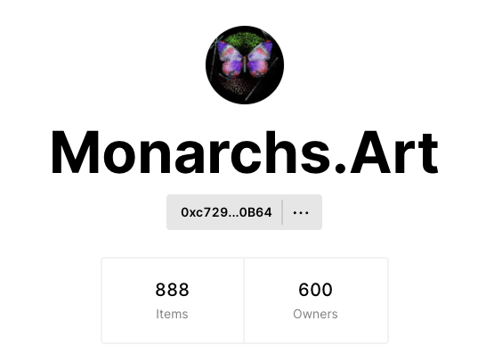

import Tabs from '@theme/Tabs'
import TabItem from '@theme/TabItem'

##### Use the Zora API to get NFT collection data

---
This guide will cover how to retreive NFT collection data for [Monarchs](https://zora.co/collections/0xc729Ce9bF1030fbb639849a96fA8BBD013680B64).  
Data can be retrieved for any collection by using these queries by updating the `collectionAddress`.

:::note

GraphiQL Playground: https://api.zora.co/graphql

Moncharhs Contract: `0xc729Ce9bF1030fbb639849a96fA8BBD013680B64`

A collection is a group of NFTs that all share a single contract.

:::

---
## Getting a Collection Preview
First off can begin by getting a preview of the Monarchs collection by using the `collections` query. 
This query can fetch data for either multiple NFT collections or a specific collection. 

<Tabs
  defaultValue="query"
  values={[
    { label: 'Query', value: 'query', },
    { label: 'Response', value: 'response', }
  ]
}>
<TabItem value="query">

```graphql
query CollectionInfo {
  collections(networks: [{network: ETHEREUM, chain: MAINNET}], pagination: {limit: 8, offset: 0}, sort: {sortKey: CREATED, sortDirection: ASC}, where: {collectionAddresses: "0xc729Ce9bF1030fbb639849a96fA8BBD013680B64"}) {
    nodes {
      address
      name
      symbol
      totalSupply
    }
  }
}

```

</TabItem>
<TabItem value="response">

```json
{
  "data": {
    "collections": {
      "nodes": [
        {
          "address": "0xc729ce9bf1030fbb639849a96fa8bbd013680b64",
          "name": "Monarchs",
          "symbol": "MONARCH",
          "totalSupply": 888
        }
      ]
    }
  }
}
```

</TabItem>
</Tabs>

---

## Collection Stats
Now let's look at a few general collection stats for Monarchs.
Below we are using the `aggregateStat` query to get the information we need.


<br/> 

We can see that there are 888 total Monarchs that are held by 600 different addresses 
and the collection has done over 2251 ETH in sales volume across all markets.

<Tabs
  defaultValue="query"
  values={[
    { label: 'Query', value: 'query', },
    { label: 'Response', value: 'response', }
  ]
}>
<TabItem value="query">

```graphql
query MonarchCollectionStats {
  aggregateStat {
    nftCount(where: {collectionAddresses: "0xc729Ce9bF1030fbb639849a96fA8BBD013680B64"})
    ownerCount(where: {collectionAddresses: "0xc729Ce9bF1030fbb639849a96fA8BBD013680B64"})
    salesVolume(
              where: {collectionAddresses: ["0x335eeef8e93a7a757d9e7912044d9cd264e2b2d8"]}, 
              networks: [{network: ETHEREUM, chain: MAINNET}]) {
        ethPrice,
        usdcPrice,
        totalCount
    }
  }
}
```

</TabItem>
<TabItem value="response">

```json
{
  "data": {
    "aggregateStat": {
      "nftCount": 888,
      "ownerCount": 599,
      "salesVolume": {
        "ethPrice": 2251.8138718689625,
        "usdcPrice": 6937731.650811332,
        "totalCount": 12601
      }
    }
  }
}
```
</TabItem>
</Tabs>

---

## Minting History
Next let's look at the first NFT that was ever minted from this collection.
We can see that it was minted on November 6th, 2021 for 0 ETH.
A deeper dive will tell you that this is the creator's wallet and they were able to mint the first 20 Monarchs for free.

<Tabs
  defaultValue="query"
  values={[
    { label: 'Query', value: 'query', },
    { label: 'Response', value: 'response', }
  ]
}>
<TabItem value="query">

```graphql
query FirstMonarchMinted {
  mints(where: {collectionAddresses: "0xc729Ce9bF1030fbb639849a96fA8BBD013680B64"}, 
        pagination: {limit: 1, offset: 0}, 
        sort: {sortKey: TIME, sortDirection: ASC}) 
  {
    nodes {
      token {
        tokenId
        owner
        mintInfo {
          originatorAddress
          price {
            ethPrice {
              decimal
            }
          }
          mintContext {
            transactionHash
            blockTimestamp
          }
        }
      }
    }
  }
}
```

</TabItem>
<TabItem value="response">

```json
{
  "data": {
    "mints": {
      "nodes": [
        {
          "token": {
            "tokenId": "0",
            "owner": "0x1d14d9e297dfbce003f5a8ebcf8cba7faee70b91",
            "mintInfo": {
              "originatorAddress": "0x4628d77ba8fcc7a7f2b6bd4a0363061a06e7a20f",
              "price": {
                "ethPrice": {
                  "decimal": 0
                }
              },
              "mintContext": {
                "transactionHash": "0x0d5bfe26cacd6a9b678427f4aca229204d758757478246bc766c7e3844f9be1a",
                "blockTimestamp": "2021-10-06T15:55:44"
              }
            }
          }
        }
      ]
    }
  }
}
```
</TabItem>
</Tabs>

<br/>

:::note
One thing to call out is that sometimes collections will airdrop their tokens to people to trick certain interfacs into making it look like that address minted from the collection.
A way to prevent this is to compare the `originatorAddress` with the `toAddress`.
:::

However, if we set the offset in pagination to 20 we can view the 21st Monarch minted and see that it minted at 0.8 ETH.

<Tabs
  defaultValue="query"
  values={[
    { label: 'Query', value: 'query', },
    { label: 'Response', value: 'response', }
  ]
}>
<TabItem value="query">

```graphql
query TwentyFirstMonarchMinted {
  mints(where: {collectionAddresses: "0xc729Ce9bF1030fbb639849a96fA8BBD013680B64"}, 
        pagination: {limit: 1, offset: 20}, 
        sort: {sortKey: TIME, sortDirection: ASC}) 
  {
    nodes {
      token {
        tokenId
        owner
        mintInfo {
          originatorAddress
          price {
            ethPrice {
              decimal
            }
          }
          mintContext {
            transactionHash
            blockTimestamp
          }
        }
      }
    }
  }
}
```

</TabItem>
<TabItem value="response">

```json
{
  "data": {
    "mints": {
      "nodes": [
        {
          "token": {
            "name": "Monarch #21",
            "owner": "0x79bc543be01d2b346d659fa69bb25c73436ffa05",
            "tokenId": "20",
            "mintInfo": {
              "originatorAddress": "0x79bc543be01d2b346d659fa69bb25c73436ffa05",
              "price": {
                "blockNumber": 13366366,
                "ethPrice": {
                  "decimal": 0.8
                }
              },
              "mintContext": {
                "blockNumber": 13366366,
                "blockTimestamp": "2021-10-06T16:00:17",
                "transactionHash": "0x07d236e70c1647f1d8504df7ea74435c01b276e2effe54b1df463a2ea7c76235"
              }
            }
          }
        }
      ]
    }
  }
}
```
</TabItem>
</Tabs>

---

## Higheset Sales

Next, by using the `sales` query and sorting by descending `ETH_PRICE` we are able to see the largest sales for Monarchs. 
We can see that the largest sale was tokenId 624 for 8.88 ETH on October 6th, 2021.

<Tabs
  defaultValue="query"
  values={[
    { label: 'Query', value: 'query', },
    { label: 'Response', value: 'response', }
  ]
}>
<TabItem value="query">

```graphql
query TopMonarchSales {
  sales(where: {collectionAddresses: "0xc729Ce9bF1030fbb639849a96fA8BBD013680B64"}, 
        pagination: {limit: 3}, 
        sort: {sortKey: ETH_PRICE, sortDirection: DESC})
  {
    nodes {
      sale {
        saleType
        saleContractAddress
        buyerAddress
        sellerAddress
        tokenId
        transactionInfo {
          blockTimestamp
          transactionHash
        }
        price {
          ethPrice {
            decimal
          }
          usdcPrice {
            decimal
          }
        }
      }
    }
  }
}
```

</TabItem>
<TabItem value="response">

```json
{
  "data": {
    "sales": {
      "nodes": [
        {
          "sale": {
            "saleType": "OPENSEA_SINGLE_SALE",
            "saleContractAddress": "0x7be8076f4ea4a4ad08075c2508e481d6c946d12b",
            "buyerAddress": "0xc89a6f24b352d35e783ae7c330462a3f44242e89",
            "sellerAddress": "0x040fc4f814321242c4e19114cfd7493bebb3b121",
            "tokenId": "624",
            "transactionInfo": {
              "blockTimestamp": "2021-10-06T17:30:36",
              "transactionHash": "0xf0179b678809acff8535ad89338bc7fa8a87d28cc10f07c7e595ef823b0e4690"
            },
            "price": {
              "ethPrice": {
                "decimal": 8.88
              },
              "usdcPrice": {
                "decimal": 31729.60193029824
              }
            }
          }
        },
        {
          "sale": {
            "saleType": "OPENSEA_SINGLE_SALE",
            "saleContractAddress": "0x7be8076f4ea4a4ad08075c2508e481d6c946d12b",
            "buyerAddress": "0x7ae920bef29c849415635b1b97f1ceb33dca89b6",
            "sellerAddress": "0x63035f1421fd4292c3f802cccf3060a4b94dcace",
            "tokenId": "865",
            "transactionInfo": {
              "blockTimestamp": "2021-10-06T19:38:45",
              "transactionHash": "0xa24328cc093d38e61d6bc0b53f5543d081c6fa4e3e9387ecc2dca427d831c23f"
            },
            "price": {
              "ethPrice": {
                "decimal": 7.77
              },
              "usdcPrice": {
                "decimal": 27832.857309572228
              }
            }
          }
        },
        {
          "sale": {
            "saleType": "OPENSEA_SINGLE_SALE",
            "saleContractAddress": "0x7be8076f4ea4a4ad08075c2508e481d6c946d12b",
            "buyerAddress": "0xa9a1b8c4ee2cf76e8b22c5dad3976d269e4050e5",
            "sellerAddress": "0x50d6102774fe54dd7d073a27f45dffacb51fa667",
            "tokenId": "887",
            "transactionInfo": {
              "blockTimestamp": "2021-10-06T18:58:48",
              "transactionHash": "0x89786c7c2e1e113f43a919dcecb3b9270d1526b3fc629ead4a1ccccc9e0b6537"
            },
            "price": {
              "ethPrice": {
                "decimal": 6.9
              },
              "usdcPrice": {
                "decimal": 24736.902321472273
              }
            }
          }
        }
      ]
    }
  }
}
```
</TabItem>
</Tabs>

---

## Top Holders
We are able to view who the Monarch whales are by using `ownersByCount` on `aggregateStat`. 
This order the addresses that hold the most NFTs of a collection in descending order.

<Tabs
  defaultValue="query"
  values={[
    { label: 'Query', value: 'query', },
    { label: 'Response', value: 'response', }
  ]
}>
<TabItem value="query">

```graphql
query TopHolders {
  aggregateStat {
    ownersByCount(where: {collectionAddresses: "0xc729Ce9bF1030fbb639849a96fA8BBD013680B64"}, 
                  pagination: {limit: 5}) {
      nodes {
        owner
        count
      }
    }
  }
}
```

</TabItem>
<TabItem value="response">

```json
{
  "data": {
    "aggregateStat": {
      "ownersByCount": {
        "nodes": [
          {
            "owner": "0x7ae920bef29c849415635b1b97f1ceb33dca89b6",
            "count": 65
          },
          {
            "owner": "0x8bace3a49a375027868cdd34e84521eed1f1b01d",
            "count": 16
          },
          {
            "owner": "0xc78b646d26f73ae8428c49d0e94cc50b1525388a",
            "count": 13
          },
          {
            "owner": "0x4628d77ba8fcc7a7f2b6bd4a0363061a06e7a20f",
            "count": 10
          },
          {
            "owner": "0x7b4a5410713fe715312d4bb99b30ab00f045f2f4",
            "count": 9
          }
        ]
      }
    }
  }
}
```
</TabItem>
</Tabs>

---

## Preview Tokens in a Collection
Here we are able to get a list of NFTs within the Moncharhs collection. 
You are able to make the preview as simple or complex as you would like.
In this example we are getting 3 tokens from the collection using the `tokens` query and returning all the metadata for each token.

<Tabs
  defaultValue="query"
  values={[
    { label: 'Query', value: 'query', },
    { label: 'Response', value: 'response', }
  ]
}>
<TabItem value="query">

```graphql
query PreviewTokens {
  tokens(networks: [{network: ETHEREUM, chain: MAINNET}], 
         pagination: {limit: 3, offset: 0}, 
         sort: {sortKey: MINTED, sortDirection: ASC}, 
         where: {collectionAddresses: ["0xc729Ce9bF1030fbb639849a96fA8BBD013680B64"]}) 
  {
    nodes {
      token {
        collectionAddress
        tokenId
        name
        tokenUrl
        metadata
      }
    }
  }
}

```

</TabItem>
<TabItem value="response">

```json
{
  "data": {
    "tokens": {
      "nodes": [
        {
          "token": {
            "collectionAddress": "0xc729ce9bf1030fbb639849a96fa8bbd013680b64",
            "tokenId": "0",
            "name": "Monarch #1",
            "tokenUrl": "ipfs://QmXuEFJVjQrHX7GRWY2WnbUP59re3WsyDLZoKqXvRPSxBY/0",
            "metadata": {
              "name": "Monarch #1",
              "description": "Monarchs is a limited edition series of generative butterfly NFTs by Eric Hu and Roy Tatum. Viewable as both still and moving image, each artwork features a unique one-of-a-kind butterfly with varying wing shapes, colors, bodies, and patterns—some traits much less common than others.",
              "tokenId": 0,
              "image": "https://gateway.pinata.cloud/ipfs/QmYBY9R9YDZNyx7eSSA99vZynyyuwwYxHoBZSYtEuVsSd3",
              "animation_url": "https://gateway.pinata.cloud/ipfs/QmdSBDJz88EWUu6Hg2BJA6PghN8iM4L3N4VEJ3QmoLkaJu",
              "external_url": "https://www.monarchs.art",
              "attributes": [
                {
                  "trait_type": "Environment",
                  "value": "Pony"
                },
                {
                  "trait_type": "Base Pattern",
                  "value": "Shinzaemon"
                },
                {
                  "trait_type": "Secondary Pattern",
                  "value": "Krakow"
                },
                {
                  "trait_type": "Wing Shape",
                  "value": "Osman"
                },
                {
                  "trait_type": "Body Type",
                  "value": "Qing"
                }
              ]
            }
          }
        },
        {
          "token": {
            "collectionAddress": "0xc729ce9bf1030fbb639849a96fa8bbd013680b64",
            "tokenId": "1",
            "name": "Monarch #2",
            "tokenUrl": "ipfs://QmXuEFJVjQrHX7GRWY2WnbUP59re3WsyDLZoKqXvRPSxBY/1",
            "metadata": {
              "name": "Monarch #2",
              "description": "Monarchs is a limited edition series of generative butterfly NFTs by Eric Hu and Roy Tatum. Viewable as both still and moving image, each artwork features a unique one-of-a-kind butterfly with varying wing shapes, colors, bodies, and patterns—some traits much less common than others.",
              "tokenId": 1,
              "image": "https://gateway.pinata.cloud/ipfs/QmXxgX5Qyhqz1t9wDFkvJtjVKYe1f8Uj714RV2n1LS76Pg",
              "animation_url": "https://gateway.pinata.cloud/ipfs/QmcDsZSJ4m9SYZCeEE3BbnpsfXCrMV7RJSbinTr3izS2C3",
              "external_url": "https://www.monarchs.art",
              "attributes": [
                {
                  "trait_type": "Environment",
                  "value": "Der Zeit"
                },
                {
                  "trait_type": "Base Pattern",
                  "value": "Dailo"
                },
                {
                  "trait_type": "Secondary Pattern",
                  "value": "Zeitan"
                },
                {
                  "trait_type": "Wing Shape",
                  "value": "Suiko"
                },
                {
                  "trait_type": "Body Type",
                  "value": "Qing"
                }
              ]
            }
          }
        },
        {
          "token": {
            "collectionAddress": "0xc729ce9bf1030fbb639849a96fa8bbd013680b64",
            "tokenId": "2",
            "name": "Monarch #3",
            "tokenUrl": "ipfs://QmXuEFJVjQrHX7GRWY2WnbUP59re3WsyDLZoKqXvRPSxBY/2",
            "metadata": {
              "name": "Monarch #3",
              "description": "Monarchs is a limited edition series of generative butterfly NFTs by Eric Hu and Roy Tatum. Viewable as both still and moving image, each artwork features a unique one-of-a-kind butterfly with varying wing shapes, colors, bodies, and patterns—some traits much less common than others.",
              "tokenId": 2,
              "image": "https://gateway.pinata.cloud/ipfs/QmNZ5SiMhHSCTeU1UfDJ3GMpwmrwDdSq9qWMwa1K2JQ2hr",
              "animation_url": "https://gateway.pinata.cloud/ipfs/QmUu8wBnue5d4DnhGmrGJwQPxGj9QuFf8a66W8XYU9Mwiu",
              "external_url": "https://www.monarchs.art",
              "attributes": [
                {
                  "trait_type": "Environment",
                  "value": "Donatello"
                },
                {
                  "trait_type": "Base Pattern",
                  "value": "Katana"
                },
                {
                  "trait_type": "Secondary Pattern",
                  "value": "Nero"
                },
                {
                  "trait_type": "Wing Shape",
                  "value": "Mary"
                },
                {
                  "trait_type": "Body Type",
                  "value": "Mothma"
                }
              ]
            }
          }
        }
      ]
    }
  }
}
```

</TabItem>
</Tabs>

---

## Getting Stats on Attributes
Viewing the distribution of attributes can done by using the `aggregateAttributes` query.
This will return the value, percent, count for every attribute if provided by the NFT.
Note, that some on-chain NFTs don't have attributes directly in their metadata.
<Tabs
  defaultValue="query"
  values={[
    { label: 'Query', value: 'query', },
    { label: 'Response', value: 'response', }
  ]
}>
<TabItem value="query">

```graphql
query AggregateAttributesByCollectionAddress {
  aggregateAttributes(
        where: {collectionAddresses: ["0xc729Ce9bF1030fbb639849a96fA8BBD013680B64"], 
    }, 
        networks: [{network: ETHEREUM, chain: MAINNET}]
    ) {
    traitType
    valueMetrics {
      count
      percent
      value
    }
  }
}
```

</TabItem>
<TabItem value="response">

```json
```
</TabItem>
</Tabs>

---

## Search Collection by Keyword
The Zora API is able to find any token or collection that contains a specific keyword. 
In this case the query is searching for tokens in the Monarch colletion that have the word "Venom". 
We can see here that "Venom" ends up being a type of Base Pattern for Monarchs.
<Tabs
  defaultValue="query"
  values={[
    { label: 'Query', value: 'query', },
    { label: 'Response', value: 'response', }
  ]
}>
<TabItem value="query">

```graphql
query CollectionTextSearch {
  search(pagination: {limit: 5}, 
         query: {text: "Venom"}, 
         filter: {collectionAddresses: "0xc729Ce9bF1030fbb639849a96fA8BBD013680B64", 
         entityType: TOKEN})
  {
    nodes {
      entity {
        ... on Token {
          tokenId
          owner
          attributes {
            traitType
            value
          }
        }
      }
    }
  }
}
```

</TabItem>
<TabItem value="response">

```json
{
  "data": {
    "search": {
      "nodes": [
        {
          "entity": {
            "tokenId": "117",
            "owner": "0x09b14b1c8a92bca0cc592a80dc311bf1a3fde9f5",
            "attributes": [
              {
                "traitType": "Environment",
                "value": "Donatello"
              },
              {
                "traitType": "Base Pattern",
                "value": "Venom"
              },
              {
                "traitType": "Secondary Pattern",
                "value": "Krakow"
              },
              {
                "traitType": "Wing Shape",
                "value": "Suiko"
              },
              {
                "traitType": "Body Type",
                "value": "Mothma"
              }
            ]
          }
        },
        {
          "entity": {
            "tokenId": "280",
            "owner": "0x17b1cb1ad28e8e8b038139e95cf6223ee7e8b572",
            "attributes": [
              {
                "traitType": "Environment",
                "value": "Compile"
              },
              {
                "traitType": "Base Pattern",
                "value": "Venom"
              },
              {
                "traitType": "Secondary Pattern",
                "value": "Nehemiah"
              },
              {
                "traitType": "Wing Shape",
                "value": "Krimhelde"
              },
              {
                "traitType": "Body Type",
                "value": "Mothma"
              }
            ]
          }
        },
        {
          "entity": {
            "tokenId": "285",
            "owner": "0xa5c2b80bcfa9201df2310a47ded0b282f6b79bee",
            "attributes": [
              {
                "traitType": "Environment",
                "value": "Curtain"
              },
              {
                "traitType": "Base Pattern",
                "value": "Venom"
              },
              {
                "traitType": "Secondary Pattern",
                "value": "Nikto"
              },
              {
                "traitType": "Wing Shape",
                "value": "Nubis"
              },
              {
                "traitType": "Body Type",
                "value": "Mothma"
              }
            ]
          }
        },
        {
          "entity": {
            "tokenId": "620",
            "owner": "0x954536dacf5860f3c8d4dd0d25b7a85818e08864",
            "attributes": [
              {
                "traitType": "Environment",
                "value": "Zeitung"
              },
              {
                "traitType": "Base Pattern",
                "value": "Venom"
              },
              {
                "traitType": "Secondary Pattern",
                "value": "Zara"
              },
              {
                "traitType": "Wing Shape",
                "value": "Theodora"
              },
              {
                "traitType": "Body Type",
                "value": "Mothma"
              }
            ]
          }
        },
        {
          "entity": {
            "tokenId": "87",
            "owner": "0x968794b44f79079b10ca33e5584cff591e590461",
            "attributes": [
              {
                "traitType": "Environment",
                "value": "Compile"
              },
              {
                "traitType": "Base Pattern",
                "value": "Venom"
              },
              {
                "traitType": "Secondary Pattern",
                "value": "Malawi"
              },
              {
                "traitType": "Wing Shape",
                "value": "Gemma"
              },
              {
                "traitType": "Body Type",
                "value": "Mothma"
              }
            ]
          }
        }
      ]
    }
  }
}
```
</TabItem>
</Tabs>

---