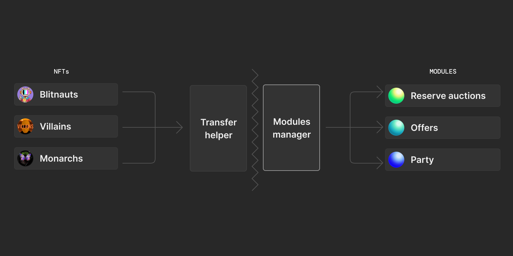

##### Learn the first steps to getting started building with ZORA

---
ZORA V3 provides different types of market functionality that allows anyone to get started building with NFTs.
However, before being able to interact with specific functionality certain approvals must be granted to ZORA.



V3 consists of a few core contracts and an ever-expanding set of modules. 
Modules are non-upgradable contracts that provide specific functionality.
The ZORA core contracts include **Token Transfer Helpers** and the **Module Manager**.

- **Transfer Helper:** Handles transferring ERC-20 and ERC-721 tokens for the modules
- **Module Manager:** Manages which modules a user has approved to use their tokens

### Required Approvals

Before interacting with specific modules, there are a few approvals steps that are required.
First, any assets that are going to be moved by ZORA must have their respective Transfer Helper approved to the token contract.
For example, if you would like to sell an NFT, the ERC-721 Transfer Helper address must be approved to the NFT contract as an operator.
Second, once the assets have been approved to the Transfer Helpers, the necessary modules must be approved in the Module Manager by the user.

##### Approval Steps
1. Approve Tokens to the Transfer Helpers
2. Approve Modules in the Module Manager

---

### Initial Code Setup
The following code examples will walk you through how to approve both Transfer Helpers and the Module Manager.
This first section will show you how to get set up to interact with the ZORA contracts using the `ethers` js library.

The ABIs for all ZORA V3 contracts can be found in the `@zoralabs/v3` npm package.
You can use the following 2 packages to import the ABIs and typechain types (if using typescript):

`yarn add @zoralabs/v3 ethers` or `npm install @zoralabs/v3 ethers`

```javascript
import { ethers } from "ethers";
import mainnetZoraAddresses from "@zoralabs/v3/dist/addresses/1.json"; // Mainnet addresses, 4.json would be Rinkeby Testnet 
import { IERC721__factory } from "@zoralabs/v3/dist/typechain/factories/IERC721__factory";
import { IERC20__factory } from "@zoralabs/v3/dist/typechain/factories/IERC20__factory";
import { ZoraModuleManager__factory } from "@zoralabs/v3/dist/typechain/factories/ZoraModuleManager__factory";

// This should be an ethers.js signer instance: 
// You can get the signer from a wallet using web3modal/rainbowkit/blocknative wallet etc.
// See: https://docs.ethers.io/v5/api/signer/
const provider = new ethers.providers.Web3Provider(web3.currentProvider, 1);
const signer = await provider.getSigner();
const moduleManagerAddress = mainnetZoraAddresses.ZoraModuleManager;
const ownerAddress = "0xF296178d553C8Ec21A2fBD2c5dDa8CA9ac905A00"; // Owner of the assets

// Initialize NFT demo contract
const nftContractAddress = "0x8d04a8c79cEB0889Bdd12acdF3Fa9D207eD3Ff63"; // Blitmap NFT Contract
const erc721Contract = IERC721__factory.connect(nftContractAddress, signer);

// Initialize ERC20 currency demo contract
const erc20ContractAddress = "0xA0b86991c6218b36c1d19D4a2e9Eb0cE3606eB48"; // USDC token address
const erc20Contract = IERC20__factory.connect(nftContractAddress, signer);

// Initialize Zora V3 Module Manager contract 
const moduleManagerContract = ZoraModuleManager__factory.connect(mainnetZoraAddresses.ZoraModuleManager, signer);
```
##### Different Networks
Note these examples use `Mainnet`, but if you would like to test on `Rinkeby` then you can update the `networkId` in the import to be `4` to get the `Rinkeby` addresses.

`@zoralabs/v3/dist/addresses/1.json` change to `@zoralabs/v3/dist/addresses/4.json` 

You can also get `Rinkeby` ETH at the faucet [here](https://www.rinkebyfaucet.com/).

---
### Approving a Transfer Helper
Tokens must first be approved to the correct Transfer Helper before being able to be used by ZORA V3.
A token approval to the ZORA Transfer Helpers will **only ever need to be done once per token contract per user address**.
Once a token is approved to the Transfer Helper it can then be used by any approved V3 module. 
In addition, each module only ever needs to be approved once per user address.
:::note 
If a user is trying to make a purchase with **just ETH** then they don't need to approve Transfer Helpers or ZORA modules.
:::

##### ERC-721 Tokens
ZORA V3 requires that the ERC-721 Transfer Helper has been approved as an operator to be able to move the NFT.
First, check if the ERC-721 Transfer Helper can access the NFTs for the user's address. 
Then submit a transaction calling the `setApprovalForAll` to approve all NFTs if not already approved.

```
// Read Function
function isApprovedForAll(address _owner, address _operator) 

// Write Function
function setApprovalForAll(address _operator, bool _approved)
```

```javascript
const erc721TransferHelperAddress = mainnetZoraAddresses.ERC721TransferHelper;
const approved = await erc721Contract.isApprovedForAll(
  ownerAddress, // NFT owner address
  erc721TransferHelperAddress // V3 Module Transfer Helper to approve
);

// If the approval is not already granted, add it.
if (approved === false) {
// Notice: Since this interaction submits a transaction to the blockchain it requires an ethers signer.
// A signer interfaces with a wallet. You can use walletconnect or injected web3.
  await erc721Contract.setApprovalForAll(erc721TransferHelperAddress, true);
}
```

##### ERC-20
If an NFT is priced in an ERC-20 token then the user will first need to approve their tokens to the ERC-20 Transfer Helper.
You can check the user's allowance to the ZORA Transfer Helper by calling the `allowance` function and then set the approved amount by calling the `approve` function.
Note that ZORA is compatible with any ERC-20.

```
// Read Function
function allowance(address _owner, address _spender) 

// Write Function
function approve(address _spender, uint256 _amount)
```

```javascript
const erc20TransferHelperAddress = mainnetZoraAddresses.ERC20TransferHelper;
const approvedAmount = await erc20Contract.allowance(ownerAddress, erc20TransferHelperAddress);
const infiniteApprovalAmount = ethers.constants.MaxUint256; // Inifite approval is used here but any amount can be specified

if (approvedAmount === "0") {
    await erc20Contract.approve(ownerAddress, erc20TransferHelperAddress, infiniteApprovalAmount);
}
```

---

### Approving Modules in the Module Manager
Once all the necessary tokens have been approved to the correct Transfer Helpers, 
the user will then need to submit a transaction to allow specific ZORA modules to have access to their assets.
For example, if a user would like to sell an NFT via the `Asks v1.1 Module` they will need to approve that module in the Module Manager for the `Asks 1.1 Module` to be able to transfer the NFT in the event of a sale.

##### Single Module
A user can approve a single module by calling `setApprovalForModule` with the address of the module they would like to approve and a boolean.

```
// Read Function
function isModuleApproved(address _user, address _module) // Read Only Function

// Write Function
function setApprovalForModule(address _module, bool _approved)
```

```javascript
// Approving Asks v1.1
const approved = await moduleManagerContract.isModuleApproved(ownerAddress, mainnetZoraAddresses.AsksV1_1);

if (approved === false) {
    await moduleManagerContract.setApprovalForModule(mainnetZoraAddresses.AsksV1_1, true);
}
```

##### Multiple Modules
In addition, a user can batch approve modules in a single transaction by calling `setBatchApprovalForModules` and passing in an array of module addresses with a boolean.

```
// Write Function
function setBatchApprovalForModules(address[] _modules, bool _approved)
```

``` javascript
// Approving Asks v1.1 and Offers v1.0
const zoraModuleAddresses = [mainnetZoraAddresses.AsksV1_1, mainnetZoraAddresses.OffersV1];
await moduleManagerContract.setBatchApprovalForModules(
    zoraModuleAddresses, 
    true
);
```

---

### Revoking Access
At some point, a user might want to revoke ZORA's ability to access their assets. 
Approvals to ZORA can be revoked at any time and there are two ways to do it.

#### Revoking Transfer Helper
By revoking access to the Transfer Helper you will remove the ability for all ZORA modules to be able to move the asset.

##### ERC-721

```javascript
const approved = await erc721Contract.isApprovedForAll(ownerAddress, erc721TransferHelperAddress);
if (approved === true) {
    await erc721Contract.setApprovalForAll(erc721TransferHelperAddress, false);
}
```

##### ERC-20 

```javascript
const approvedAmount = await erc20Contract.allowance(ownerAddress, erc721TransferHelperAddress);
if (approvedAmount !== "0") {
    await erc20Contract.approve(ownerAddress, erc721TransferHelperAddress, "0");
}
```

#### Revoking Module Manager
If you would like the ZORA Transfer Helpers to still have access to your assets, 
but you would like to restrict certain modules you can either revoke a single module or batch revoke.

##### Single Module
```javascript
const approved = await moduleManagerContract.isModuleApproved(ownerAddress, mainnetZoraAddresses.AsksV1_1);
if (approved === true) {
    await moduleManagerContract.setApprovalForModule(mainnetZoraAddresses.AsksV1_1, false);
}
```

##### Multiple Modules
``` javascript
const zoraModuleAddresses = [mainnetZoraAddresses.AsksV1_1, mainnetZoraAddresses.OffersV1]; // Asks v1.1 and Offers v1.0
await moduleManagerContract.setBatchApprovalForModules(
    zoraModuleAddresses, 
    false
);
```

---

Now that you have learned how to approve and revoke tokens to ZORA you are ready to begin interacting with the different ZORA V3 Modules.
You can get started learning about how to sell an NFT [here](./sell-nft-fixed-price).