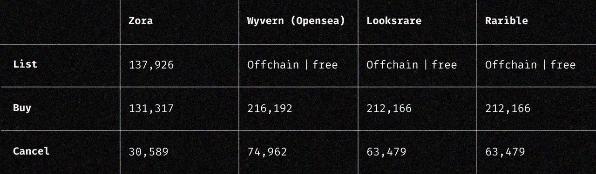

##### An overview of the latest version of ZORA
---

### The NFT Marketplace Protocol
ZORA is the NFT marketplace protocol—it never goes down, it’s composable, immutable, universally accessible, and censorship-resistant. 
ZORA V3 includes some novel mechanisms that incentivize platforms built on the protocol, as well as a groundbreaking modular architectural design that allows for a permissionless system that can continue to deploy new versions. 

:::note
If you are interested to contributing to ZORA V3 you can learn more [here](https://github.com/ourzora/v3#contributing).
You can also view all the of core V3 addresses [here](./smart-contracts/zora-v3).
:::

 

### Modular Architecture
ZORA V3 uses an architecture which allows for the Zora DAO to deploy new market types and updated versions.
Each deployed version of a market module is permissionless and can never be changed, but the DAO can deploy the module into the approval space of Zora. 

This facilitates developers to choose which modules they use and easily utilize new versions without entire migrations (like the one we’re doing from V2 to V3), and lowers the amount of total gas that’s required to be spent.

 

### Finder’s Fee
The finder’s fee is a mechanism that allows people to incentivize the market to find the eventual buyer of their NFT. This is set when you list an NFT.
To earn a finder’s fee, simply include your address—either programmatically in a UI or by generating a link—and you’ll earn that reward if you find the buyer.
This is a powerful incentive for builders and curators to integrate the ZORA protocol and capture the value they are creating directly.

 

### Gas-Efficient
To fully harness the power of a decentralized network, every action costs gas; you are paying for the constant and universally accessible benefits of an onchain market—but there’s still a cost. 
We’ve spent countless hours optimizing the protocol to be as gas-efficient as possible.

It’s 39% cheaper to buy using the ZORA protocol than the next best option: Wyvern Protocol (used by OpenSea). Whilst the options above are free to list, this comes at the expense of composability and uptime.

 

### Onchain and Unstoppable Markets
ZORA V3 is a one-way deployment, meaning it cannot be stopped or changed by anyone at any time. If platforms built on top of it go down, the market will still function properly because the orders live onchain, not in a database.
If you’re a developer, you won’t need to ask permission to interact and build on top of the market—you can access all of the market functionality directly onchain.

 

### Instant and Cross-Platform Royalties
If an NFT from Art Blocks, Foundation, Manifold or a custom collection built with `EIP-2981` Royalty Standard is bought and sold on ZORA, the royalties will be paid out instantly and trustlessly onchain.
This unlocks an entirely new dimension of programmability for developers wanting build with royalties in mind.

We’ve also integrated the Royalty Registry, meaning any collection owner can configure their royalties on the ZORA Marketplace Protocol, regardless of the platforms or tools used to create that collection. 
You can find the royalty tool [here](https://royaltyregistry.xyz/lookup).

 

### Community Bug Bounty
ZORA currently has a community bug bounty which you can learn more about [here](https://github.com/ourzora/v3#community-audit). 
If you find any vulnerability that could result in the loss of user funds or NFTs, reach out to t@zora.co or support@zora.co