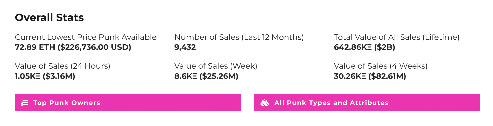
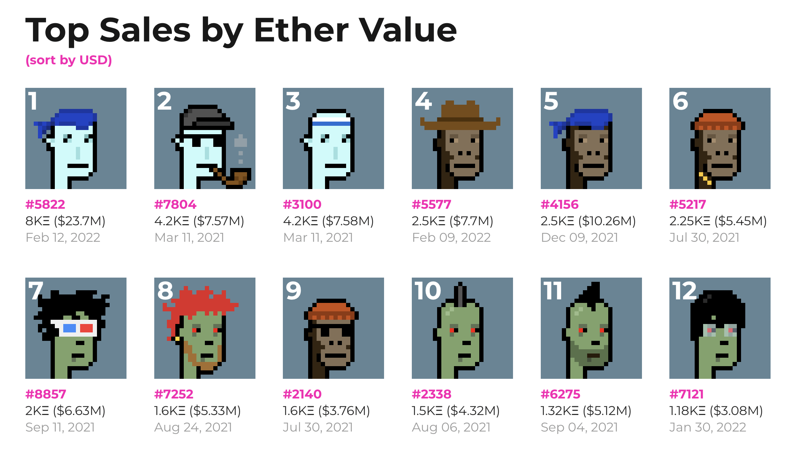
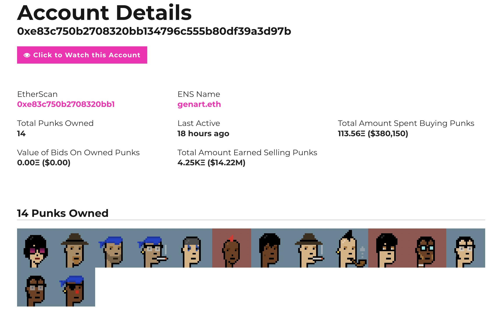
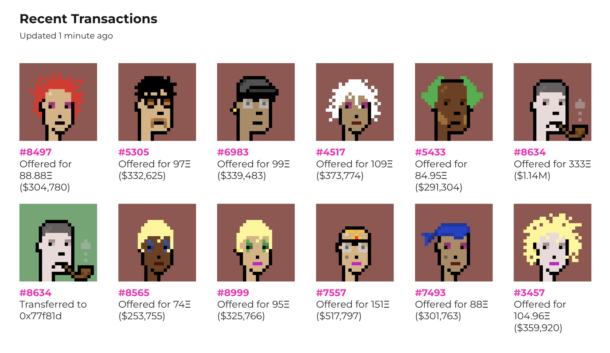
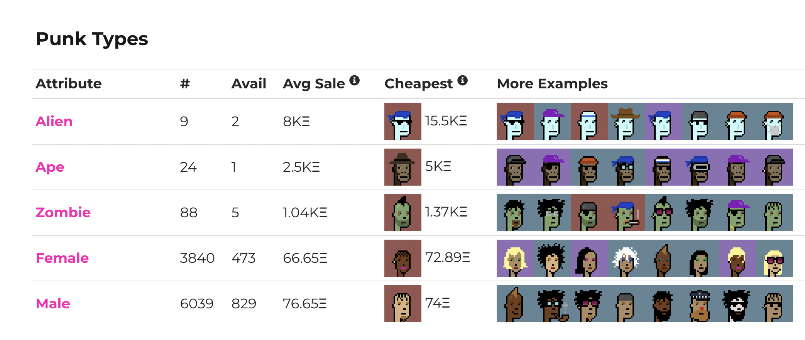
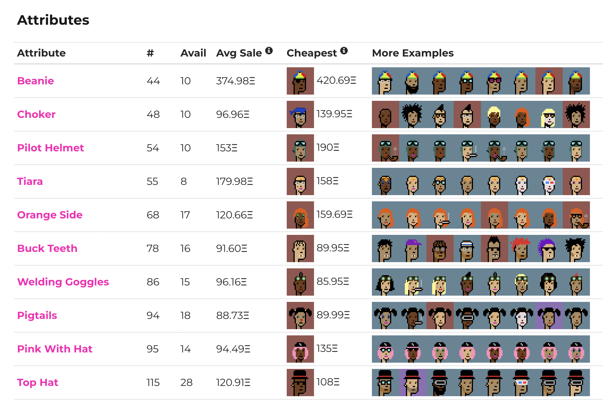
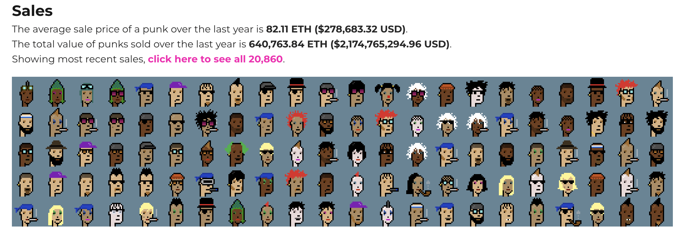
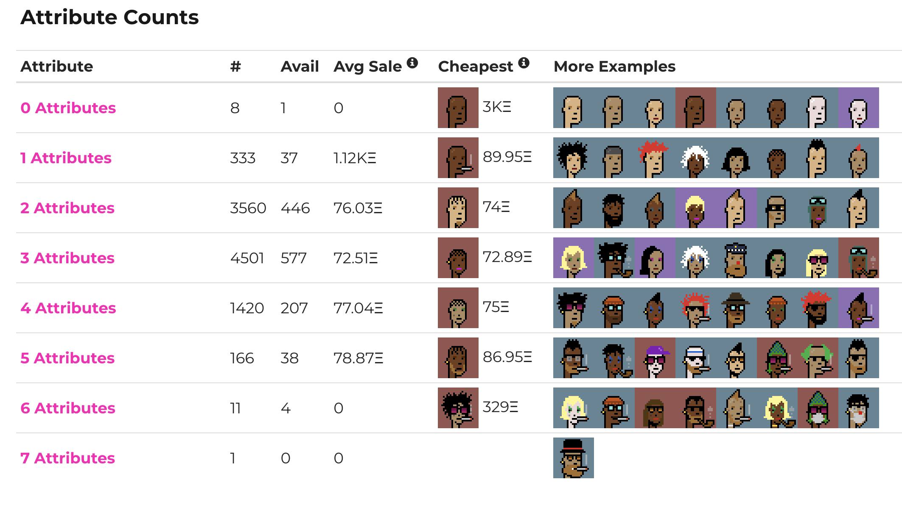
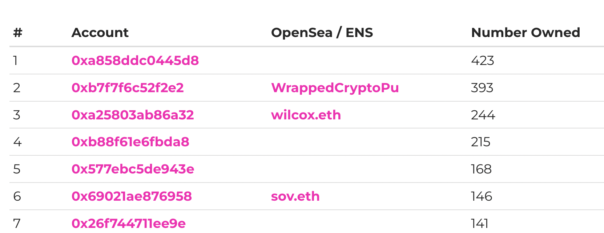

import Tabs from '@theme/Tabs'
import TabItem from '@theme/TabItem'

##### Use the Zora API to replicate the CryptoPunk Marketplace

---
## Getting Started

In this guide we will be walking through the [CryptoPunks Marketplace](https://cryptopunks.app/) and showing you how you could grab the data using the Zora API.
We will cover:
- Historic Top Sales
- Recent Punk Transactions
- Filtering by Punk Attributes
- Getting Stats on Attributes and more

You can paste the queries into the GraphiQL linked below to test them out for youself.

:::note

GraphiQL Playground: https://api.zora.co/graphql

Punks Marketplace: https://cryptopunks.app

Punks Contract Address: `0xb47e3cd837dDF8e4c57F05d70Ab865de6e193BBB`

:::

---

## Overall Stats



<Tabs
  defaultValue="query"
  values={[
    { label: 'Query', value: 'query', },
    { label: 'Response', value: 'response', }
  ]
}>
<TabItem value="query">

```graphql
```

</TabItem>
<TabItem value="response">

```json
```
</TabItem>
</Tabs>

---

## Top Sales
The [Top Sales Page](https://cryptopunks.app/cryptopunks/topsales) lists the largest Punks sales in history. 
Fun fact, there are some sales that have been omitted due to the fact that some [buyers have flash loaned ETH](https://decrypt.co/84756/no-someone-didnt-really-pay-532-million-cryptopunk-nft) to make the purchase to have extremely large sale amount.

By using the `sales` query with `collectionAddress` of the Punks contract and filtering by `LARVA_LABS_SALE` we are able to grab largest sales in Punk history. 




<Tabs
  defaultValue="query"
  values={[
    { label: 'Query', value: 'query', },
    { label: 'Response', value: 'response', }
  ]
}>
<TabItem value="query">

```graphql
query PunkSales {
  sales(
    sort:{sortKey: ETH_PRICE, sortDirection: DESC}, 
    networks: {chain: MAINNET, network: ETHEREUM}, 
    filter: {saleFilters: {saleType: LARVA_LABS_SALE}}, 
    where: {collectionAddresses: ["0xb47e3cd837dDF8e4c57F05d70Ab865de6e193BBB"]}, 
    pagination: {limit: 12}
    ) {
    nodes {
      tokenId,
      transactionInfo {
        blockTimestamp
      },
      price {
        ethPrice {
          decimal
        },
        usdcPrice {
          decimal
        }
      }
    }
  }
}
```

</TabItem>
<TabItem value="response">

```json
```
</TabItem>
</Tabs>

---

## Account Details

`0xe83c750b2708320bb134796c555b80df39a3d97b`


<Tabs
  defaultValue="query"
  values={[
    { label: 'Query', value: 'query', },
    { label: 'Response', value: 'response', }
  ]
}>
<TabItem value="query">

```graphql
```

</TabItem>
<TabItem value="response">

```json
```
</TabItem>
</Tabs>


---

## Recent Transactions



<Tabs
  defaultValue="query"
  values={[
    { label: 'Query', value: 'query', },
    { label: 'Response', value: 'response', }
  ]
}>
<TabItem value="query">

```graphql
```

</TabItem>
<TabItem value="response">

```json
```
</TabItem>
</Tabs>

---

## Punk Types



<Tabs
  defaultValue="query"
  values={[
    { label: 'Query', value: 'query', },
    { label: 'Response', value: 'response', }
  ]
}>
<TabItem value="query">

```graphql
```

</TabItem>
<TabItem value="response">

```json
```
</TabItem>
</Tabs>

---

## Punk Attributes




<Tabs
  defaultValue="query"
  values={[
    { label: 'Query', value: 'query', },
    { label: 'Response', value: 'response', }
  ]
}>
<TabItem value="query">

```graphql
```

</TabItem>
<TabItem value="response">

```json
```
</TabItem>
</Tabs>

---

## Recent Sales



<Tabs
  defaultValue="query"
  values={[
    { label: 'Query', value: 'query', },
    { label: 'Response', value: 'response', }
  ]
}>
<TabItem value="query">

```graphql
```

</TabItem>
<TabItem value="response">

```json
```
</TabItem>
</Tabs>

---

## Attribute Counts



<Tabs
  defaultValue="query"
  values={[
    { label: 'Query', value: 'query', },
    { label: 'Response', value: 'response', }
  ]
}>
<TabItem value="query">

```graphql
```

</TabItem>
<TabItem value="response">

```json
```
</TabItem>
</Tabs>

---

## Punk Count by Address




<Tabs
  defaultValue="query"
  values={[
    { label: 'Query', value: 'query', },
    { label: 'Response', value: 'response', }
  ]
}>
<TabItem value="query">

```graphql
```

</TabItem>
<TabItem value="response">

```json
```
</TabItem>
</Tabs>
