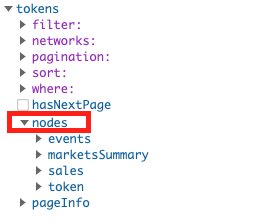
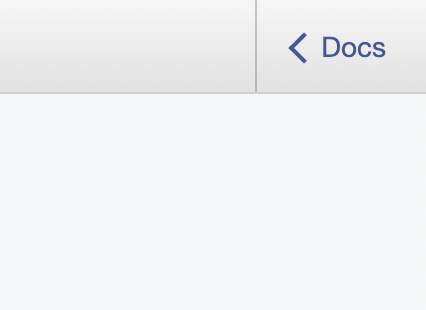
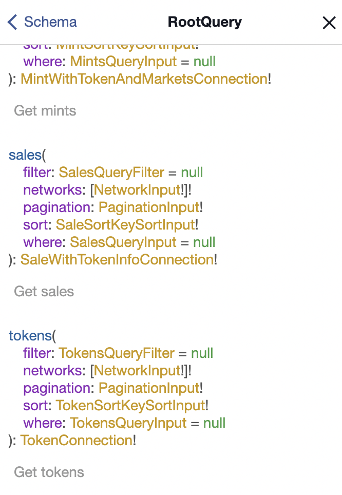

# Introduction

##### The Most Powerful NFT API

---

The ZORA API makes it easy to retrieve NFT metadata, monitor on-chain events, analyze sales activity, and so much more. 

:::note

API Endpoint: https://api.zora.co/graphql

<!-- [SDK](./zdk-api): Use the API without needing to know GraphQL -->

:::
## Key Features
- Data on every Ethereum NFT contract and its associated events (Transfers, Mints, etc.)
- Sales data from every marketplace (ZORA, OpenSea, LooksRare, 0x, etc.)
- Media is encoded to provide assets at different sizes
- Automatically syncs newly deployed NFT contracts
- Adaptable to any chain and token standard
- Text-based search for discoverability
- Built with GraphQL
- ENS compatible

---

## Getting Started
If you are unfamiliar with GraphQL, we recommend that you [check out this resource](https://www.howtographql.com/basics/0-introduction/). 
In addition, here are a few considerations before using the API.

<!-- - The [ZDK](./zdk-api) allows anyone to build top on of the API without needing to know GraphQL. -->
- Currently supports any `ERC-721` NFTs on `Ethereum Mainnet`
- Maximum page size limit is `500` for regular queries and `50` for text-based searches
- Expanding to other chains and tokens standards soon
- Check out the guides section to begin building

---

## Authentication

| **Needs**                 | **API Key Requiments**|
| ------------------------- | --------------------- |
| < 30 requests per minute  | No Key Needed         |
| > 30 requets per minute   | Key Needed            |

Direct message [@ZORAEngineering](https://twitter.com/ZORAEngineering) on Twitter for an API Key.

---

## Example Collections

Here are a few NFT contract addresses to test the API with:

- `Zorbs`: 0xCa21d4228cDCc68D4e23807E5e370C07577Dd152
- `Monarchs`: 0xc729Ce9bF1030fbb639849a96fA8BBD013680B64
- `Crypto Dickbutts`: 0x42069ABFE407C60cf4ae4112bEDEaD391dBa1cdB

---

## Navigating GraphiQL

This section provides an overview of how to use [GraphiQL](https://api.zora.co/graphql) to test the API.

### Explorer

The explorer allows anyone to quickly view the different queries. 
To access the explorer, click on the "Explorer" button at the top. 

You will then see a pop-out on the left side of the screen. 
This section will show all the queries along with their parameters.
GraphiQL will populate the queries into the sandbox if you click on them.

 

It is recommended that the response be formatted by clicking into the nodes section and selecting what should be returned.

 

### Docs

The Docs section of GraphiQL can be accessed by clicking on "Docs" in the top left of the page. 

 

Clicking on "Root Query" will display the types for both the arguments and the responses.

