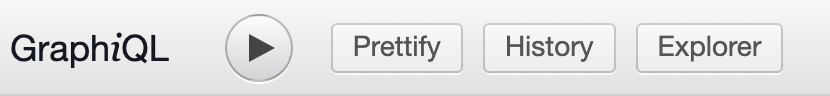

import exploreTab from "../../static/img/graphiQL/qlExplorer.png"
import exploreTab2 from "../../static/img/graphiQL/qlExplorer2.png"
import graphiqlDocs from "../../static/img/graphiQL/graphiqlDocs.png"
import graphQueries from "../../static/img/graphiQL/graphQueries.png"


# Introduction

##### The Most Powerful NFT API

---

The ZORA API makes it easy to retrieve NFT metadata, monitor on-chain events, analyze sales activity, and so much more. 

:::note

✨ **You can test out the API without needing a key. It’s free to use right now** ✨

API Endpoint: https://api.zora.co/graphql

[SDK](./zdk): A development kit to use the API without needing to know GraphQL

[NFT Hooks](../developer-tools/nft-hooks/intro): A tool that makes NFT data retrieval even easier than the ZDK

:::
## Key Features
- Sales info from every marketplace (ZORA, OpenSea, LooksRare etc.)
- Data on every Ethereum NFT contract (Transfers, Mints, etc.)
- Media is encoded to provide assets at different sizes
- Automatically syncs newly deployed NFT contracts
- Fill orders made on OpenSea (Seaport)
- Text-based search for discoverability
- And much more

---

## Supported Networks
The API is expanding to more networks and currently supports:

Network     | ChainId | Status             |
------------|---------|--------------------|
ETH Mainnet | 1       |   Entire History   |
Rinkeby     | 4       |   Tip of Chain as of Block 11145300    |
Goerli      | 5      |   Coming Soon     |

---

## Getting Started
If you are unfamiliar with GraphQL, we recommend that you [check out this resource](https://www.howtographql.com/basics/0-introduction/). 
In addition, here are a few considerations before using the API.

- The [ZDK](./zdk) and [NFT Hooks](../developer-tools/nft-hooks/intro) allows anyone to build top on of the API without needing to know GraphQL.
- Currently supports any `ERC-721` NFTs
- Maximum page size limit is `500` for regular queries and `50` for text-based searches
- Check out the guides section to begin building

---

## Authentication

Anyone can use the API **without an API key** as long as the application is making **less than 120 requests per minute.**

| **Needs**                 | **API Key Requirements**|
| ------------------------- | ---------------------   |
| Less than 120 requests per minute  | **No Key Needed**           |
| Greater than 120 requests per minute   | Key Needed              |

Direct message [@ZORAEngineering](https://twitter.com/ZORAEngineering) on Twitter for an API key if your needs require **greater than 120 requests per mintue.**
To access the API with a key, add a header in your requests with the key `X-API-KEY` .

```
headers={"X-API-KEY": <your_api_key>}
```

---

## Example Collections

Here are a few NFT contract addresses to test the API with:

- `Zorbs`: 0xCa21d4228cDCc68D4e23807E5e370C07577Dd152
- `Monarchs`: 0xc729Ce9bF1030fbb639849a96fA8BBD013680B64
- `Crypto Dickbutts`: 0x42069ABFE407C60cf4ae4112bEDEaD391dBa1cdB

---

## Navigating GraphiQL

This section provides an overview of how to use [GraphiQL](https://api.zora.co/graphql) to test the API.


### Explorer

The explorer allows anyone to quickly view the different queries. 
To access the explorer, click on the "Explorer" button at the top. 



You will then see a pop-out on the left side of the screen. 
This section will show all the queries along with their parameters.
GraphiQL will populate the queries into the sandbox if you click on them.


<br/>

It is recommended that the response be formatted by clicking into the nodes section and selecting what should be returned.

<br/>


### Docs

The Docs section of GraphiQL can be accessed by clicking on "Docs" in the top left of the page. 


<br/>

Clicking on "Root Query" will display the types for both the arguments and the responses.

